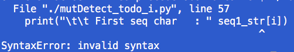

# Bioinformatics (CMPSC 300) Lab 2

This repository contains information about Bioinformatics lab 2 deliverables. This assignment invites students to write Python code to complete an Analysis of DNA.

## Dates

Handed out: 12 Sept 2022

Due: 19 Sept 2022

<!-- ### Submission notes Please submit all deliverables through your assignment GitHub repository. + Place report document writing directory -->

 ## Contents

- [Objectives](#Objectives)
- [Cloning Your Repository](#Cloning-Your-Repository)
- [Analysis Program](#Analysis-Program)
- [Deliverables](#Deliverables)
- [Assessment](#Assessment)

--------------------------------------------------------------------------------

<center>
  
</center>

Caption: As shown in Figure above, we note the Central Dogma of Biology. According to this principle, DNA is used to obtain RNA, which is applied to obtain protein. Throughout seemingly all biology, this one dogma presents itself universally.

In this lab, we will be working with this central aspect of biology, creating a Python program which has been designed to convert DNA to RNA (via transcription) and then produce protein (via translation).

## Objectives

- To experience a better understanding of how the Central Dogma of Biology is involved in Bioinformatics field.
- To work with Python and to explore problem solving techniques for handling errors (bugs) in code.
- To use completed Python code to perform sequence experiments which are foundational to research in Bioinformatics.

## Cloning Your Repository

Repository link: [https://classroom.github.com/a/tqoDBUWF](https://classroom.github.com/a/tqoDBUWF)

To use this link, please follow the steps below.

- Click on the link and accept the assignment.
- Once the importing task has completed, click on the created assignment link which will take you to your newly created GitHub repository for this lab.
- Clone this repository (bearing your name) and work locally.
- As you are working on your lab, you are to commit and push regularly. The commands are the following.

```
git add -A
git commit -m ``Your notes about the commit here''
git push
```

After you have pushed your work to your repository, please visit the repository at the GitHub website (you may have to log-in using your browser) to verify that your files were correctly sent.

## Analysis Program

The program that you have been given in the `src/mutDetect.py` is supposed to compare sequences and to perform basic translations of two user-entered sequences. It is then supposed to compare the protein sequences of the two DNA sequences to find changes in product. Unfortunately, this code was written hastily and, as a result, contains **TWELVE** (12) basic coding bugs (i.e., typographical errors) that prevent the code from working properly. **Your task is to complete the code by fixing the errors to allow it to run and to display the output shown below.**

---

---

Your output should look similar to the following. Note, you will have to provide a dummy parameter to run the code or the help screen will be displayed instead. Here, the dummy parameter is `run`. You also need to have `biopython` installed with `pip install biopython`, if you have not done so already.

```
bioinformaticsNumberOneFan$ python3 mutDetect.py run

     Welcome to mutDetect!
     A program to compare DNA, make protein and compare protein sequences.

 ____ INPUT DNA SEQUENCES ____
    Enter a sequence :CTTCTT
     + Length of first sequence  : 6
    Enter a sequence :CTTCTC
     + Length of second sequence : 6

 ____ COMPARING DNA SEQUENCES ____
     + Sequences are both same length:  True
     [-] Bases not the same at pos:  5
         First seq char   :  t
         Second seq char  :  c
     + Original DNA       : cttctt , length is : 6
     + RNA from DNA     : cuucuu
     + DNA from RNA     : cttctt
     + PROTEIN from RNA   : LL
     + protein1 sequence  : LL
     + Original DNA       : cttctc , length is : 6
     + RNA from DNA     : cuucuc
     + DNA from RNA     : cttctc
     + PROTEIN from RNA   : LL
     + protein2 sequence  : LL

 ____ COMPARING PROTEIN SEQUENCES ____
     + Sequences are both same length:  True
     The sequences are the same.

 ____ DETECTING SILENT MUTATIONS ____
     DNA seq 1:  cttctt
     DNA seq 2:  cttctc
     Protein sequence 1:  LL
     Protein sequence 2:  LL
    [+] Silent mutation has been detected.
```

## Silent Mutations and Detection Function in Code

Genetic mutations consist of generally random edits to the genetic material in which some unusual result may be observed. Mutations may generally be noted by measurable changes in their production, protein products or similar. However, not all mutations are obvious and their effects may not be noticed or felt until long after the mutation has been effected.

One class of interesting mutations comes from the **Silent Mutation** class, in which mutated DNA produces protein code with is exactly the same as non-mutant DNA. Although the protein that is achived from the DNA is the same, there may still be complications stemming from the DNA.

- In your code, you are challenged with the task of adding a silent mutation detection function to your code in `src/mutDetect.py`.

- In addition, in the `writing/reflections.md`, you are to briefly discuss these silent mutations and to offer an example of a disorder where they are thought to be responsible.

--------------------------------------------------------------------------------

## GatorGrade

You can check the baseline writing and commit requirements for this lab assignment by running department's assignment checking `gatorgrade` tool. To use `gatorgrade`, you first need to make sure you have Python3 installed (type `python --version` to check). If you do not have Python installed, please see:

- [Setting Up Python on Windows](https://realpython.com/lessons/python-windows-setup/)
- [Python 3 Installation and Setup Guide](https://realpython.com/installing-python/)
- [How to Install Python 3 and Set Up a Local Programming Environment on Windows 10](https://www.digitalocean.com/community/tutorials/how-to-install-python-3-and-set-up-a-local-programming-environment-on-windows-10)

Then, if you have not done so already, you need to install `gatorgrade`:

- First, [install `pipx`](https://pypa.github.io/pipx/installation/)
- Then, install `gatorgrade` with `pipx install gatorgrade`

Finally, you can run `gatorgrade`:

`gatorgrade --config config/gatorgrade.yml`


## Deliverables

- Your completed and working (bug free) code should be saved in your GitHub Classroom repository as `src/mutDetect.py`.

- Write a reflection of about 100 words to describe what is meant by a **Silent mutation** and to discuss any type of disorder which may be categorized as this kind of mutation. **It is expected that you will have to perform an online search to investigate a disorder of a silent mutations in more detail.** Your work will be saved in `writing/reflections.md`.

## Assessment

The grade that a student receives on this assignment will have the following components.

- **GitHub Actions CI Build Status [up to 25%]:**: For the lab repository associated with this assignment students will receive a checkmark grade if their last before-the-deadline build passes. This is only checking some baseline writing and commit requirements as well as correct inclusion of files. An additional reduction will given if the commit log shows a cluster of commits at the end clearly used just to pass this requirement. An addition reduction will also be given if there is no commit during lab work times. All other requirements are evaluated manually.

- **Mastery of Technical Writing [up to 25%]:**: Students will also receive a checkmark grade when the responses to the writing questions presented in the `reflection.md` reveal a proficiency of both writing skills and technical knowledge. To receive a checkmark grade, the submitted writing should have correct spelling, grammar, and punctuation in addition to following the rules of Markdown and providing conceptually and technically accurate answers.

- **Mastery of Technical Knowledge and Skills [up to 50%]**: Students will receive a portion of their assignment grade when their program implementation reveals that they have mastered all of the technical knowledge and skills developed during the completion of this assignment. As a part of this grade, the instructor will assess aspects of the programming including, but not limited to, the completeness and the correctness of the program and the use of effective source code comments.
