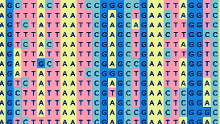

[](https://classroom.github.com/online_ide?assignment_repo_id=8745836&assignment_repo_type=AssignmentRepo)
# Bioinformatics
(CMPSC 300) Lab 4

This repository contains information about Bioinformatics lab 4 deliverables. This assignment invites students to write Python code to complete an Analysis of DNA.

## Dates

Handed out: 03 Oct 2022

Due: 17 Oct 2022

 ## Contents

- [Objectives](#Objectives)
- [Cloning Your Repository](#Cloning-Your-Repository)
- [Alignment](#Alignment)
- [Deliverables](#Deliverables)
- [Assessment](#Assessment)

--------------------------------------------------------------------------------


<center>
  
</center>

Caption: Multiple Sequence Alignment: When you compare each sequence in a group with each column lined-up, you can see commonalities across sequences. These commonalities inform researchers of the origins of the sequence.}

## Title:
What Is This Sequence?

## Objectives

- To investigate sequence data using online and local sequence analysis tools.
- To gain experience in reading output from software tools to decide upon the origins of particular sequences.

## Cloning Your Repository

Repository link: [https://]()

To use this link, please follow the steps below.

- Click on the link and accept the assignment.
- Once the importing task has completed, click on the created assignment link which will take you to your newly created GitHub repository for this lab.
- Clone this repository (bearing your name) and work locally.
- As you are working on your lab, you are to commit and push regularly. The commands are the following.

```
git add -A
git commit -m ``Your notes about the commit here''
git push
```

After you have pushed your work to your repository, please visit the repository at the GitHub website (you may have to log-in using your browser) to verify that your files were correctly sent.

## Alignment

In bioinformatics, much effort is spent comparing genetic sequences (i.e., sequences of DNA, RNA or protein) to determine information about the origins of the sequences. For example, when a patient has become sick due to a bacterial disorder, it is important to determine which bacterial organism is responsible for the ailment so that proper therapy can be administered. Unfortunately, since the specific sequence of DNA of the bacterial organism causing distress may not be known, researchers will still compare this new DNA sequence to known sequences to find resemblances from which a likely identification can be concluded.

In this lab, you are given ten organismal sequences in which some are known and some are unknown (due to mutations). Your task is to determine which sequence is related to which.

To complete this task, you are to choose whatever tool you think would best provide evidence of similarity between sequences.

As you write up your work in your lab, you are to offer  **irrefutable** evidence of your assessments concerning the relatedness of the sequences using the output of your software tool.


## BioPython: four new checks to add

In your `src` directory, the file, `openAndTestFastaSeq.py` is to be edited so that it completes four additional checks or analyses for the sequences that it processes.

You will want to first combine your individual FASTA sequences data files from this lab into a single FASTA file. This file will be loaded into the Python program for analysis.

Next, you will want to address the Function, `completeSequenceTests()` in the program to complete four additional sequence checks or tests. Two of the checks have been added but the code is still incomplete. You are to fix this code and then choose the two remaining checks or tests to add to the program. As help to guide your coding, you may use the [BioPython documentation](https://biopython.org/wiki/SeqIO), or another reference, as necessary.

Your completed code should run without crashing and be free of bugs.

### Running Your Code

It might be best to run your code from outside the `src/` directory to be able to access the data files in the `data/` directory. An output of the program when running from the project root directory is shown below. Note that the path to the FASTA file is being entered before the filename.

```
$python3 src/openAndTestFastaSeq.py
	 Enter the name of the FASTA file to open :data/1_seq.fasta
	 [+] Opening FASTA file :data/1_seq.fasta

	 [+] Sequence Name: seq_x1
	 [+] First 50 bases of sequence data: GTAGTGGTGAGACACTTGGTGTCCTTGTCCCTCATGTGGGCGAAATACCA
	 [+] Length of Sequence: 4114
	 [+] Running some tests on sequence from BioPython ...
		 - Further processing: seq_x1
```

---

## GatorGrade

You can check the baseline writing and commit requirements for this lab assignment by running department's assignment checking `gatorgrade` tool. To use `gatorgrade`, you first need to make sure you have Python3 installed (type `python --version` to check). If you do not have Python installed, please see:

- [Setting Up Python on Windows](https://realpython.com/lessons/python-windows-setup/)
- [Python 3 Installation and Setup Guide](https://realpython.com/installing-python/)
- [How to Install Python 3 and Set Up a Local Programming Environment on Windows 10](https://www.digitalocean.com/community/tutorials/how-to-install-python-3-and-set-up-a-local-programming-environment-on-windows-10)

Then, if you have not done so already, you need to install `gatorgrade`:

- First, [install `pipx`](https://pypa.github.io/pipx/installation/)
- Then, install `gatorgrade` with `pipx install gatorgrade`

Finally, you can run `gatorgrade`:

`gatorgrade --config config/gatorgrade.yml`


## Deliverables

- Your completed and working (bug free) code should be saved in your GitHub Classroom repository as `src/openAndTestFastaSeq.py`.

- Write a response to the questions in the reflection document. Your work will be saved in `writing/reflection.md`.

## Assessment

The grade that a student receives on this assignment will have the following components.

- **GitHub Actions CI Build Status [up to 25%]:**: For the lab repository associated with this assignment students will receive a checkmark grade if their last before-the-deadline build passes. This is only checking some baseline writing and commit requirements as well as correct inclusion of files. An additional reduction will given if the commit log shows a cluster of commits at the end clearly used just to pass this requirement. An addition reduction will also be given if there is no commit during lab work times. All other requirements are evaluated manually.

- **Mastery of Technical Writing [up to 25%]:**: Students will also receive a checkmark grade when the responses to the writing questions presented in the `reflection.md` reveal a proficiency of both writing skills and technical knowledge. To receive a checkmark grade, the submitted writing should have correct spelling, grammar, and punctuation in addition to following the rules of Markdown and providing conceptually and technically accurate answers.

- **Mastery of Technical Knowledge and Skills [up to 50%]**: Students will receive a portion of their assignment grade when their program implementation reveals that they have mastered all of the technical knowledge and skills developed during the completion of this assignment. As a part of this grade, the instructor will assess aspects of the programming including, but not limited to, the completeness and the correctness of the program and the use of effective source code comments.
