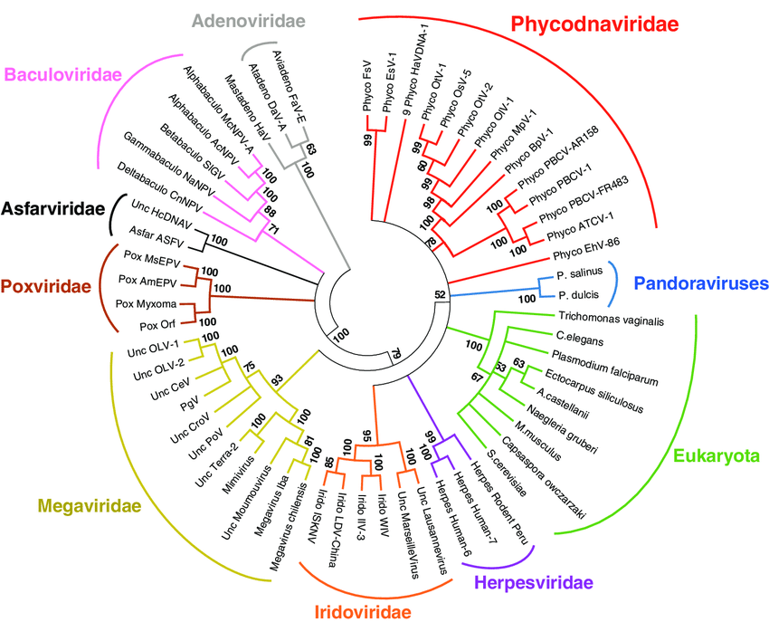

# Bioinformatics (CMPSC 300) Lab 5

This repository contains information about Bioinformatics lab 5 deliverables. This assignment invites students to find and demonstrate online tools for Bioinformatics research.

## Dates

Handed out: 17 Oct 2022

Due: 31 Oct 2022

## Contents

- [Objectives](#Objectives)
- [Cloning Your Repository](#Cloning-Your-Repository)
- [Part 1](#Part-1)
- [Part 2](#Part-2)
- [Deliverables](#Deliverables)
- [Assessment](#Assessment)

---

## Objectives

- To gain skill in reading literature and gathering facts about the described science.
- To gain experience in installing software, learning to use the software and then applying the software to data to gain results.

## Cloning Your Repository

To use the link that you were given in class, please follow the steps below.

- Click on the link and accept the assignment.
- Once the importing task has completed, click on the created assignment link which will take you to your newly created GitHub repository for this lab.
- Clone this repository (bearing your name) and work locally.
- As you are working on your lab, you are to commit and push regularly. The commands are the following.

```
git add -A
git commit -m ``Your notes about the commit here''
git push
```

After you have pushed your work to your repository, please visit the repository at the GitHub website (you may have to log-in using your browser) to verify that your files were correctly sent.


## Online Tool and Data for Presentation

Much research in Bioinformatics can be performed by free and open source tools which are first introduced by articles of the literature. In addition gaining a good grasp over its ideas and concepts in the articles, information is given about how results were determined by the authors. For these results, tools (and data) are often supplied to the community with the article.

In this lab, you will read an article from the scientific literature  for comprehension of the science and the tool that it introduces. You are then to go to the GitHub repository to try out the supplied tool with the sample data.

Often, a tutorial and data is offered along with the tool to help users to get acquainted with the software. For the tool of this lab, some sample data has been included with the tool at associated GitHub site.The user is invited to follow commands to learn the tool and make results to study. Part of your lab grade is to try the same commands to activate the tool.

There are two parts to this lab to consider.

### Part 1

In this lab, you are to read the article, __An interactive viral genome evolution network analysis system enabling rapid large-scale molecular tracing of SARS-CoV-2__, by Ling _et al_(which is found in your working repository). In their work, the authors determine an algorithmic method to map the DNA sequence changes of a SARS-Cov2 (Covid-19) virus during its evolution. In particular, the authors discuss the principles of cladistics (see definition below) and develop a tool using sequence alignment to study this phenomenon. An example of these population clades can be noted from the below figure.

 <center>
 
 </center>

Definition of cladistics : a system of biological taxonomy that defines taxa uniquely by shared characteristics not found in ancestral groups and uses inferred evolutionary relationships to arrange taxa in a branching hierarchy such that all members of a given taxon have the same ancestors (Merriam-Webster).

+ __Reading Comprehension__: Once you have completed reading of this article, you are to address the reading comprehension questions in `writing/reflection.md`.

### Part 2.

In the article, the authors introduce a tool called VENAS -- an acronym for a __viral genome Evolutionary Analysis System__, which they used to study the cladistics of evolving viral organisms. In this part, you are invited to download the tool from the author's GitHub repository (https://github.com/qianjiaqiang/VENAS)[https://github.com/qianjiaqiang/VENAS] and try running the code. Fortunately, there is data and instructions at the GitHub site for the user to read to be able to effectively learn how to use the tool on the supplied data.

+ __Using the Tool__: Once the user has understood the instructions for using the tool, please try running it. Record your commands, results and conclusions in the `writing/reflections.md` file.

## References

The references from the lab are listed below for convenience.

+ The article: __An interactive viral genome evolution network analysis system enabling rapid large-scale molecular tracing of SARS-CoV-2__
   + Article Link: https://www.ncbi.nlm.nih.gov/pmc/articles/PMC8743795/
   + GitHub: https://github.com/qianjiaqiang/VENAS

+ __Network Viewing Software__: To determine the magnitude of the results from the tool, a network is outputted. The outputted network is actually a text file which is to be loaded into a viewing software such as one of the suggestions below.
As with any project, the investigator is often required to spend time researching other softwares which are necessary to utilize the current one. In this work, you will need to learn how to use a network viewer software. Two recommendations are provided below: One requires the user to install binary software locally. The other one may be used as a local javascript project.  

   + Gephi binary download: [https://gephi.org/users/download/](https://gephi.org/users/download/)
   + JavaScript GEXF Viewer for Gephi: [https://github.com/raphv/gexf-js](https://github.com/raphv/gexf-js) Note: In the File `config.js`, the `graphfile` option may be updated with the name of the local file containing the network output from the tool. In order to view the network, a local server is to be run. Python3 can proide such a local network using the command, `python3 -m http.server` and then using a browser for `http://localhost:8000/`. The details for this can be found at the project GitHub repository.

## GatorGrade

You can check the baseline writing and commit requirements for this lab assignment by running department's assignment checking `gatorgrade` tool. To use `gatorgrade`, you first need to make sure you have Python3 installed (type `python --version` to check). If you do not have Python installed, please see:

- [Setting Up Python on Windows](https://realpython.com/lessons/python-windows-setup/)
- [Python 3 Installation and Setup Guide](https://realpython.com/installing-python/)
- [How to Install Python 3 and Set Up a Local Programming Environment on Windows 10](https://www.digitalocean.com/community/tutorials/how-to-install-python-3-and-set-up-a-local-programming-environment-on-windows-10)

Then, if you have not done so already, you need to install `gatorgrade`:

- First, [install `pipx`](https://pypa.github.io/pipx/installation/)
- Then, install `gatorgrade` with `pipx install gatorgrade`

Finally, you can run `gatorgrade`:

`gatorgrade --config config/gatorgrade.yml`

## Deliverables

- Write a reflection of about 200 words to describe the tool. The above-mentioned themes of Part 1 to consider are also to be addressed in your `writing/reflection.md` document.


## Assessment

The grade that a student receives on this assignment will have the following components.

- **GitHub Actions CI Build Status [up to 25%]:**: For the lab repository associated with this assignment students will receive a checkmark grade if their last before-the-deadline build passes. This is only checking some baseline writing and commit requirements as well as correct inclusion of files. An additional reduction will given if the commit log shows a cluster of commits at the end clearly used just to pass this requirement. An addition reduction will also be given if there is no commit during lab work times. All other requirements are evaluated manually.

- **Mastery of Technical Writing [up to 25%]:**: Students will also receive a check mark grade when the responses to the writing questions presented in the `reflection.md` reveal a proficiency of both writing skills and technical knowledge. To receive a check mark grade, the submitted writing should have correct spelling, grammar, and punctuation in addition to following the rules of Markdown and providing conceptually and technically accurate answers.

- **Mastery of Technical Knowledge and Skills [up to 50%]**: Students will receive a portion of their assignment grade when their program implementation reveals that they have mastered all of the technical knowledge and skills developed during the completion of this assignment. As a part of this grade, the instructor will assess aspects of the programming including, but not limited to, the completeness and the correctness of the program and the use of effective source code comments.
